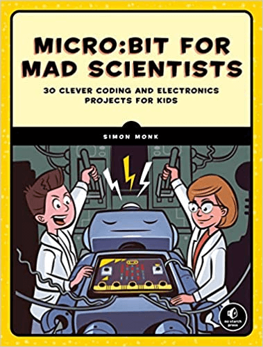
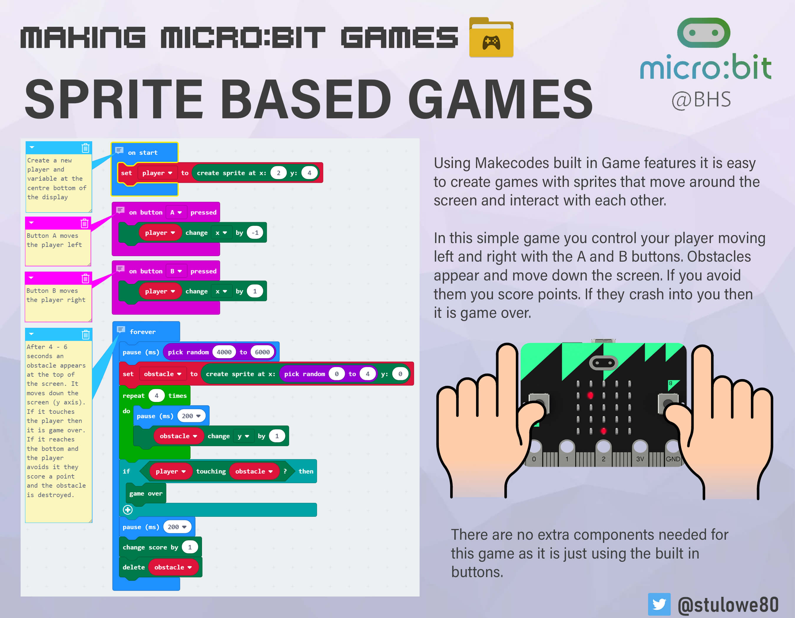

## Coding the micro:bit

To start coding I just went to these sites and started to create projects from scratch:

- [MakeCode editor](https://makecode.microbit.org/) (Blocks programming)
- [Python editor](https://python.microbit.org/v/3) (Python programming)

I also followed the books from Simon Monk:

- [Micro:bit for mad scientists](https://www.amazon.com/Micro-bit-Scientists-Simon-Monk/dp/1593279744)
- [Programming the BBC micro:bit with micropython](https://www.amazon.com/Programming-BBC-micro-Getting-MicroPython/dp/1260117588)

| Book 1 | Book 2 |
|--------|--------|
|  |  |

## List of projects

Here I am showing the projects divided into several categories:

Basic projects

- [Flashing Heart](https://makecode.microbit.org/_Rfa0Mo6tpRKM)
- [Name tag](https://makecode.microbit.org/_aD2XhCa2g874)
- [Name tag Accelerated](https://makecode.microbit.org/_fqebfqVVxgw0)
- [Similey Buttons](https://makecode.microbit.org/_EC5YWPh89PoU)
- [Dice](https://makecode.microbit.org/_1d5KmygbwcXW)
- [Dice with dots](https://makecode.microbit.org/_LMTJryDCdCy7)
- [Love Meter (Hold P0 + GND)](https://makecode.microbit.org/_i7A8puV2r5h6)
- [Sleepy Pet Hamster](https://makecode.microbit.org/_Uj7401Hsf5fF)
- [Countdown 3, 2, 1... GO!](https://makecode.microbit.org/_h9XP3k4Dw92Y)
- [Clap Lights](https://makecode.microbit.org/_gqTEYaeL7i0b)
- [Clap Lights Animated](https://makecode.microbit.org/_F43D3j68F8Yj)
- [7 seconds](https://makecode.microbit.org/_UfkC2pDKmV8e)
- [Light Sensor](https://makecode.microbit.org/_FaK50yMwDhMK)
- [Light Sensor V2](https://makecode.microbit.org/_P0oARWLjdbuq)
- [Light Sensor V3](https://makecode.microbit.org/_F7LcA529i7x6)
- [Vu-meter](https://makecode.microbit.org/_Pge35MgqU0WJ)
- [Turtle - Logo Extension](https://makecode.microbit.org/_YihTzo31dftA)

Medium projects

- [Blow Away](https://makecode.microbit.org/_fEti5XKU59yi)
- [Compass](https://makecode.microbit.org/_bq8Mf9Rs1CXL)
- [Level](https://makecode.microbit.org/_caLhhC2fvfXm)
- [Level V2](https://makecode.microbit.org/_76xK944qTg3K)
- [Servos](https://makecode.microbit.org/_18P7Ecehf5Rm)

Advanced projects

- [Chess clock](https://makecode.microbit.org/_5Lz94WFpqdz3)
- [Building height measurement](https://makecode.microbit.org/_07yE0XTHHhqp)

Radio projects

- [Morse chat](https://makecode.microbit.org/_cFbP2dERpJYc)
- [Hot or Cold - Seeker](https://makecode.microbit.org/_PJfRfiUUFJYg)
- [Hot or Cold - Beacon](https://makecode.microbit.org/_Ucm9PF3sHM62)

Logging projects

>See data logging with  the micro:bit [user guide](https://microbit.org/get-started/user-guide/data-logging/)

- [Logging data (Temp & Light)](https://makecode.microbit.org/_YETE6PcwwAUF)

## Science experiments

### Battery tester
Measure the voltage of a battery with the micro:bit
- [Battery tester](https://makecode.microbit.org/_Kx8HoD38XL2e)
- See [video](https://www.youtube.com/watch?v=gdlc34nhjK4)

## Games

### Avoid obstacles

This is a Sprite based game where you should try to avoid obstacles falling on you
- [Avoid obstacles](https://makecode.microbit.org/_UDwDv5ctk0jq)
- [Avoid obstacles V2](https://makecode.microbit.org/_2MK646EDWhEr)

See instructions

 
